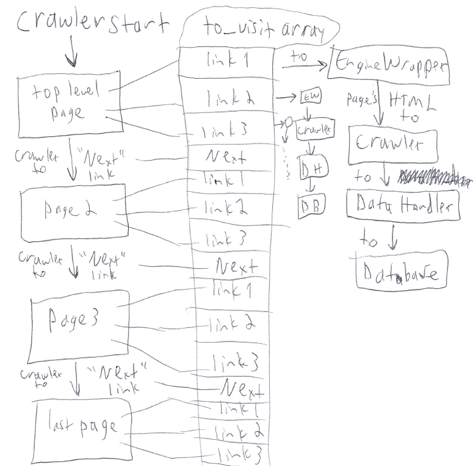

**Lukas Hoffmann notes to help understand how palantiri works, will eventually be incorporated into [README.md](README.md)**

## Basic Palantiri workflow *(TENTATIVE)*

### Workflow diagram *(TENTATIVE)*


* Example scripts are [example.py](examples/example.py), [run.py](examples/run.py), [search.py](examples/search.py). They start a separate webcrawler thread for each top-level page (e.g. ```http://atlanta.backpage.com/datelines/```)
	* Sitelist is defined by ```areas``` & ```sites``` params, either hardcoded or passed as command line args.
* After a crawler thread is initialized via ```__init__```, it starts running via its```run()``` method.
* Crawler starts a ```DataHandler``` thread and several ```EngineWrapper``` threads that will run continuously.
* Crawler gets all the links from the top-level page, does some cleanup, adds those links to the ```to_visit``` stack.
* Crawler visits next page (currently hardcoded; the HTML href that says "Next"). Adds all the links to the ```to_visit``` stack. Visits next page. Repeats until there is no more "Next", i.e. the last escort listing.
* Meanwhile, the ```EngineWrapper``` threads are running. They get the raw HTML from the next page in the ```to_visit``` stack, send it to the parent crawler via ```notify()```, repeat.
* Each time it is notified, crawler tells the ```DataHandler``` to add that page. Eventually the ```DataHandler``` will dump a bunch of those pages to the database table.
* Once crawler visits the last page, the ```to_visit``` stack is no longer added to. Eventually all the links are visited by the ```EngineWrappers``` and dumped to database by the ```DataHandler```.

## How to run it
* TODO: Add to whatever [README.md](README.md) didn't make clear already.

## Ideas what to do next


## Questions
* Should I made edits to the master branch or another branch (like rasp)?
* Some code references MongoDB, is this obsolete because it’s just using postgres? If we decided on using postgres should I get rid of the mongodb dump in search.py and change to postgresqldump?
* Does datahandler.py run the way I think it does (i.e. when threads execute, when events are set/cleared) - can I add short comments at each def?

### example.py / run.py
* could it accidentally skip one of the sites when >4 threads? If no threads are dead then it will just sleep 1 sec and continue to next site.
* What is example.py supposed to do, versus run.py? One has the postgresql dump in the loop, one outside
* Can combine example.py / run.py into one example file? Give instructions how to run the example.

### datahandler.py
* insert_evt.wait - does it stop waiting immediately when add_page is called? Or does it just wait until timeout and then execute next instruction?  
* in run method, I think that it only dumps to postgres after either len(self_to_dump)> batch size or after the timeout has been exceeded? Then it dumps 1x at the very end
 to make sure nothing was missed
 
### crawler.py
* When calling start() in other functions and for the dbhandler, does that mean the superclass Threading.Thread always calls the run() function?
* What does it mean "t.join()" and "dbhandler.join()"? I assume a core function in Thread that stops their execution?
* How does Tor engine's get_page_source method work?